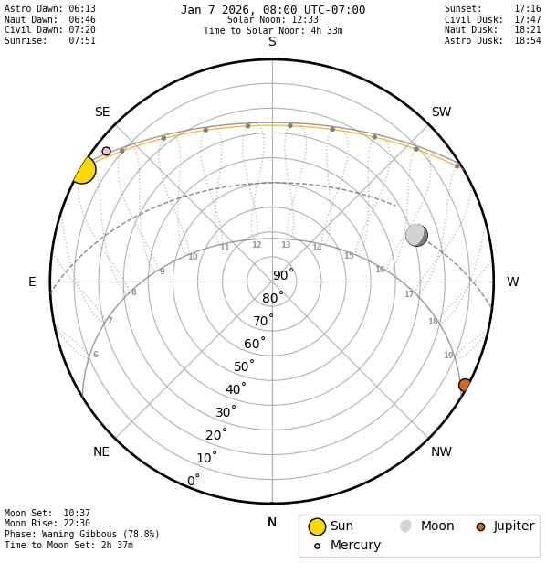
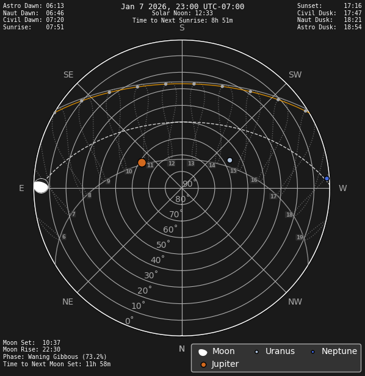

# Skyfield Web Application




This project is a Python-based web application that generates a sky chart image showing the apparent positions of the Sun, Moon, and planets. It is built using the Flask web framework and the Skyfield library for astronomical calculations. The chart is generated as a PNG image using Matplotlib.

The application is designed to be integrated with Home Assistant by setting up a [Generic Camera entity](https://www.home-assistant.io/integrations/generic/) pointing to the image URL and then display on your dashboard using a Picture entity, but can also function as a standalone service as well. Please set the refresh rate to something reasonable, like 0.0033 Hz (every 5 minutes).

If you would rather use my setup directly, you can access it now via https://skyfieldweb.duckdns.org/skychart.png. Make sure to see below for how to customize the URL for your setup.

Here is a sample setup for Home Assistant to use already configured position values, and set it to dark mode if the sun is below the horizon.

```
https://skyfieldweb.duckdns.org/skychart.png?
    lat={{ state_attr('zone.home', 'latitude') }}&
    lon={{ state_attr('zone.home', 'longitude') }}&
    gmt_offset={{ now().strftime('%z') }}&
    show_analemma=true&
    dark_mode=auto
```

## Features

*   Displays apparent positions of the Sun, Moon, and planets.
*   Generates sky charts as PNG images.
*   Customizable with latitude, longitude, elevation, and GMT offset.
*   Option to show analemma, constellations, and planets.
*   Flexible date and time input.

## Project Structure

*   `__init__.py`: Package initialization.
*   `app.py`: The main Flask application.
*   `bodies.py`: Contains logic for celestial body calculations and plotting.
*   `constellations.py`: Handles drawing constellations.
*   `__main__.py`: Allows the package to be run as a module.
*   `data/`: Directory for astronomical data files (e.g., `de421.bsp`).
*   `tests/`: Directory for unit and integration tests.
*   `venv/`: Python virtual environment.
*   `requirements.txt`: Python dependency list.
*   `LICENSE`: Project license.
*   `.gitignore`: Specifies files and directories to be ignored by Git.

## Setup and Running

### Prerequisites

*   Python 3.8+
*   `pip` (Python package installer)

### 1. Clone the repository

```bash
git clone https://github.com/larryjmoore/skyfield_web
cd skyfield_web
```

### 2. Create and activate a virtual environment

It is highly recommended to use a virtual environment to manage project dependencies.

```bash
python3 -m venv venv
source venv/bin/activate
```

### 3. Install dependencies

```bash
pip install -r requirements.txt
```

### 4. Download astronomical data

The application requires astronomical ephemeris data. This will be downloaded automatically the first time the application runs and stored in the `data/` directory. Ensure you have an active internet connection the first time you run it.

### 5. Run the application

To start the Flask development server:

```bash
python3 app.py
```

This will start the server on `http://0.0.0.0:8000`.

### 6. Access the Sky Chart

Open your web browser and navigate to:

```
http://localhost:8000/skychart.png
```

You can customize the chart by providing query parameters:

*   `lat`: Latitude (e.g., `34.0522`)
*   `lon`: Longitude (e.g., `-118.2437`)
*   `elevation`: Elevation in meters (e.g., `1447`)
*   `gmt_offset`: GMT offset in hours (e.g., `-7`, `5.5`, `5:30`, `-0700`, or `0530`)
*   `when`: A specific date and time override to generate the chart for. Accepts a variety of formats, including:
    *   `YYYY-MM-DD` (e.g., `2026-01-15`)
    *   `YYYY-MM-DD_HH:MM` (e.g., `2026-01-15_14:30`)
    *   `YYYY-MM-DD_HH:MM:SS` (e.g., `2026-01-15_14:30:00`)
    *   `YYYY-M-D` (e.g., `2026-1-1`)
*   `show_analemma`: `true` or `false` (default: `false`)
*   `show_constellation`: `true` or `false` (default: `false`)
*   `show_planets`: `true` or `false` (default: `true`)
*   `north_up`: `true` or `false` (default: `false`)
*   `show_time`: `true` or `false` (default: `true`)
*   `show_legend`: `true` or `false` (default: `true`)
*   `show_stats`: `true` or `false` (default: `true`) - Shows/hides all extra statistics (twilight, solar noon, next event, moon info).
*   `dark_mode`: `true`, `false`, or `auto` (default: `false`). Set to `auto` to enable dark mode automatically when the Sun is below the horizon.
*   `refresh`: `true` or `false` (default: `false`). Set to `true` to force a cache refresh. This bypasses the cache read but updates the cache with the new result. Useful for warming scripts.

Example:

```
http://localhost:8000/skychart.png?lat=34.1&lon=-118.2&gmt_offset=-7&show_constellation=true
```

## Cache Warming

To ensure users always get a fast "Cache HIT" response, you can run a warming script (e.g., via `cron`) every minute. Use the `refresh=true` parameter to ensure the script always generates a new image and updates the shared cache:

```bash
# Example crontab entry to warm the cache every minute
* * * * * curl -s "http://localhost:8000/skychart.png?lat=40.7&lon=-111.8&dark_mode=auto&refresh=true" > /dev/null
```

The application uses a `120s` default cache timeout, so a `60s` warming interval ensures the cache never expires for your users.

## Running Tests

To run the unit tests for this project, activate your virtual environment and run the following command:

```bash
venv/bin/pytest
```

## License

This project is licensed under the GNU General Public License v3.0. See the `LICENSE` file for details.

## Acknowledgements

This project was inspired by and adapted from the [ha_skyfield](https://github.com/partofthething/ha_skyfield) repository by @partofthething.
